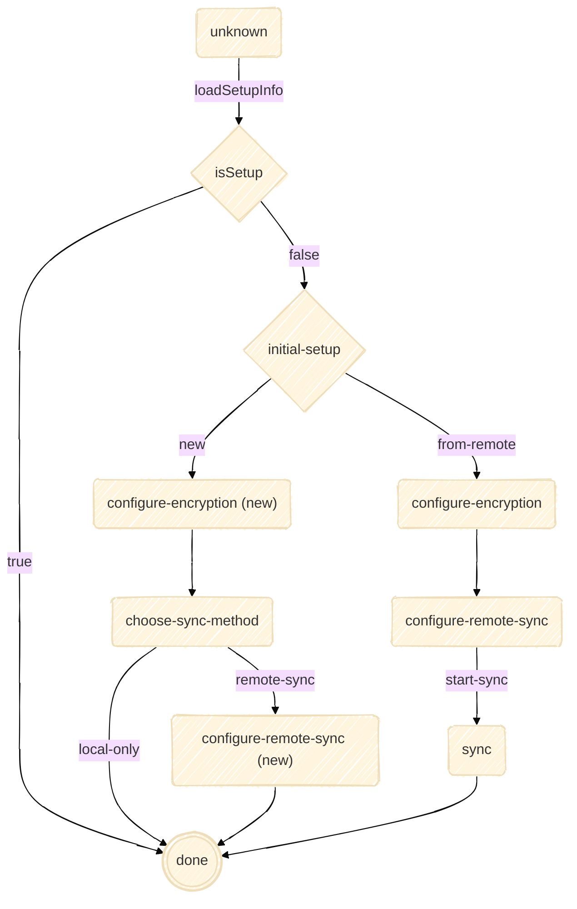

# Setup Slice

### Setup State Machine

```mermaid
---
config:
    theme: base
    look: handDrawn
---

flowchart TB
    U(unknown) -- loadSetupInfo --> L{isSetup}

    L -- true --> D(((done)))
    L -- false --> I{initial-setup}

    I -- new --> NewCE("configure-encryption (new)")
    NewCE --> NewSM(choose-sync-method)
    NewSM -- local-only --> D
    NewSM -- remote-sync --> NewCRS("configure-remote-sync (new)")
    NewCRS --> D

    I -- from-remote --> FRCE(configure-encryption)
    FRCE --> FRCRS(configure-remote-sync)
    

    FRCRS -- start-sync --> Sync(sync)
    Sync --> D
```

